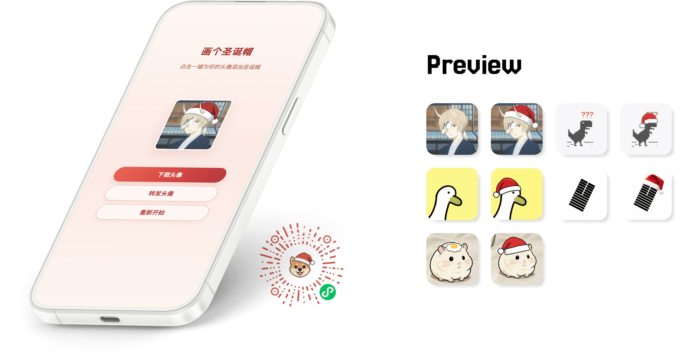

	
	
	
	

“Draw a Santa Hat” is a lightweight, playful WeChat Mini Program that puts a Santa hat on your avatar in one tap. No login, no setup—open and enjoy the holiday vibe instantly.

## ✨ Features

Core capabilities:
- Fetch your WeChat avatar (with permission)
- Auto overlay a Santa hat
- Real-time preview
- One-tap save to local album

❗ No social, no uploads, no account system, and no personal data collection.

## 🧩 How to Use

1. Scan the QR above or search “Draw a Santa Hat” in WeChat
2. Pick an avatar and tap generate
3. Preview and save the result

## ⚠️ Notes

The algorithm may occasionally produce surprising results

## 🔐 Privacy
- Avatar processing happens only on the local Canvas
- No uploads to any server
- No storage, analysis, or sharing of user data
- No phone number or login required

## 📄 License

MIT License