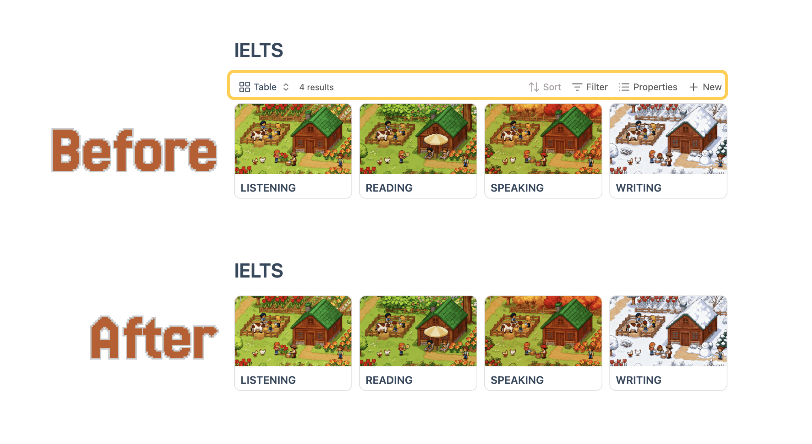

<div style="display:flex;justify-content: center;gap:0.5rem;width:auto">
	
	<!-- last commit -->
	
	<!-- release -->
	
	<!-- license -->
	
	<!-- stars -->
	
</div>


A small Obsidian plugin to **hide the Obsidian Bases toolbar and lock header interaction on demand**.  
You can quickly switch the state by clicking the **Lock / Unlock** button.

**Note:** The plugin only works in **Reading view**.



## ⬇️ Installation

### From community plugins (recommended)

You can install this plugin directly from Obsidian’s community plugins browser:

1. Open Obsidian and go to **Settings → Community plugins**
2. Select **Browse** and search for **“Bases lock”**
3. Click **Install**, then enable the plugin

You can also install it directly from the community plugins page:  
[Install from community plugins](https://obsidian.md/plugins?id=bases-lock)


### Manual install (local/dev build)

1. Create the plugin folder inside your vault:

```text
<Vault>/.obsidian/plugins/obsidian-bases-lock/
```

2. Copy these files into that folder:
   - `main.js`
   - `manifest.json`
   - `styles.css`

3. Open Obsidian:
   - Go to **Settings → Community plugins → Installed plugins**
   - Enable **Bases Lock**

4. Make sure the official **Bases** core plugin is enabled.


## ⭐ Usage

1. Move your mouse over a Base; a **locked** button will appear.
2. Click it to toggle **lock / unlock**.


## Development & build

- **Install dependencies:**

```bash
npm install
```

- **Development mode (watch build):**

```bash
npm run dev
```

- **Production build:**

```bash
npm run build
```

After building, the latest `main.js` will be generated in the plugin root folder for Obsidian to load.


### Notes

- The plugin only renders the button and controls toolbar / header behavior in **Reading view**.
- The selectors (such as `.bases-toolbar`, `.bases-header`, `.bases-thead`, etc.) depend on the current Obsidian Bases DOM structure:
  - If a future Obsidian update changes these classes, you can inspect the actual classes via DevTools and adjust the selectors in `styles.css`.
- The plugin only looks at the `.base` embed syntax (`|x` / `|o`) in the **current document** and does not scan or modify other notes.


### Design rationale

Assume `src/a.base` is embedded in any of the following forms:

- `![[src/a.base]]`
- ``
- ``
- ``

After clicking the button:

- From **unlocked → locked**
  - Any of the forms above will be normalized to:

```markdown

```

  - If there was no display name (for example `![[src/a.base]]`), the file name (without the `.base` suffix) will be used:

```markdown
![[src/a.base]]  →  
```

- From **locked → unlocked**
  - If the current syntax is ``, it will be changed to:

```markdown

```

At the same time:

- `x` → hide toolbar + disable `.bases-thead` click, button text shows **locked**
- `o` → restore toolbar and header interaction, button text shows **unlocked**


