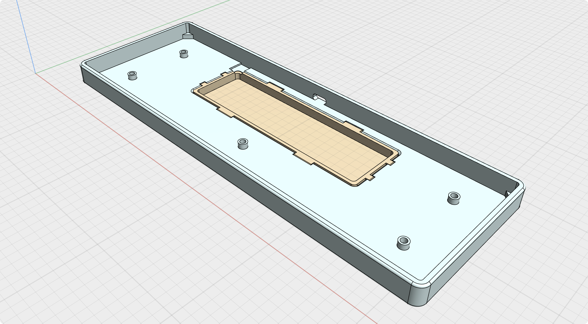
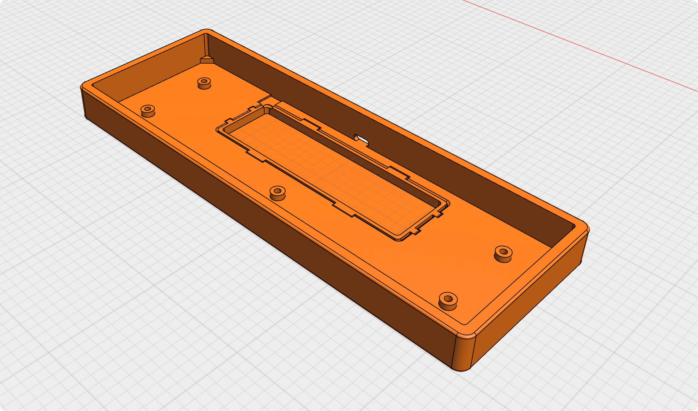
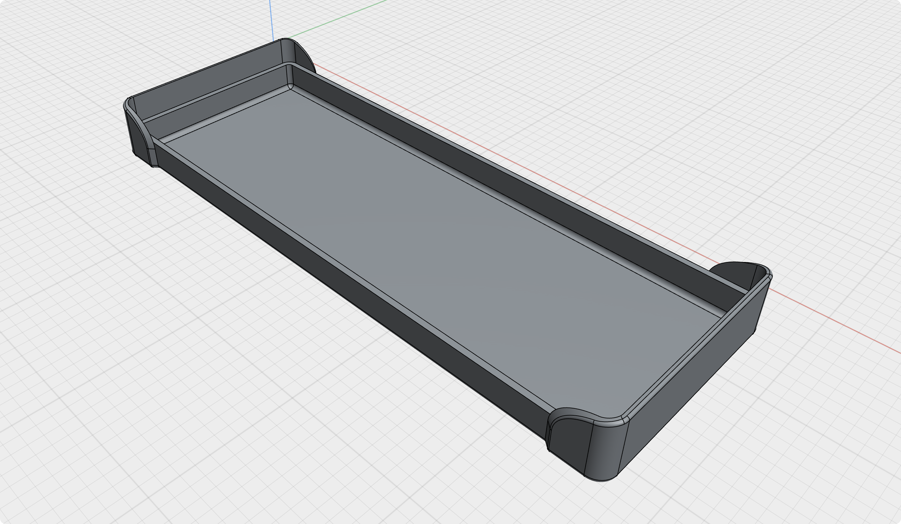

Adaptation Omega40 customized keyboard case.

Related tutorial video: https://www.bilibili.com/video/BV1DGeEejEoT

### Notes

1. You need to purchase M2/3/3.2 heat-set inserts separately.
2. Purchase a 15mm high EC11 rotary encoder according to your needs.

### File list

| NAME                        | DESCRIPTION                                   |
| --------------------------- | --------------------------------------------- |
| Omega40_dust_cover.step     | keyboard dust cover                           |
| Omega40_case_slim.step      | relatively low-profile, exposing the switches |
| Omega40_case_standard.step  | standard case                                 |
| Omega40_plate_standard.step | standard layout                               |
| Omega40_plate_planck.step   | Planck layout                                 |
| knob_case.step              | The knob needs to be purchased separately     |

### Preview

**Omega40_case_slim**

**Omega40_case_standard**

**Omega40_dust_cover**

